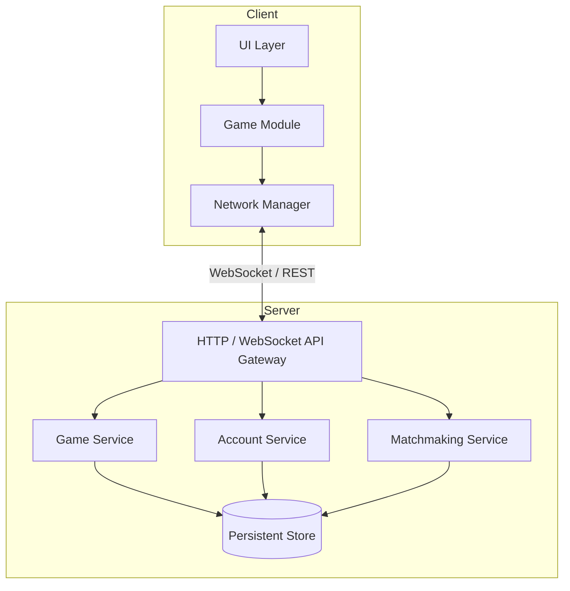

# Design Document — Sea Battle Game

## Overview

Sea Battle (Mobotan) is a turn-based naval strategy game supporting three play modes: local two-player, single-player vs AI, and online multiplayer. The system is structured as a client–server application: a stateless game-logic core shared by all modes, a server that owns authoritative state for online matches and user accounts, and a thin client responsible for rendering and user input.

### Key Design Goals

- **Correctness first**: all game-rule enforcement lives in pure, side-effect-free domain objects so they can be exhaustively tested.
- **Mode parity**: local, AI, and online modes all run through the same `PlacementEngine`, `ShotEngine`, `TurnManager`, and `VictoryDetector`; only the transport layer differs.
- **Authoritative server**: for online matches the server is the single source of truth; clients are display-only and cannot mutate state directly.
- **Account isolation**: user account management is a separate bounded context with no coupling to game logic.

---

## Architecture

### High-Level Component Diagram



### Mode-Specific Flow

| Mode | Who runs game logic | Transport |
|---|---|---|
| Local two-player | Client (Game Module) | None |
| Single-player vs AI | Client (Game Module + AI Opponent) | None |
| Online multiplayer | Server (Game Service) | WebSocket |

In local and AI modes the client runs the full game-logic stack in-process. In online mode the client sends intents (e.g., "place ship", "fire shot") to the server; the server validates, mutates state, and broadcasts events back to both clients.

---

## Components and Interfaces

### PlacementEngine

Responsible for validating and recording ship placements on a board.

```
PlacementEngine
  placeShip(board: Board, ship: ShipPlacement) → Result<Board, PlacementError>
  autoPlace(board: Board, fleet: FleetSpec) → Board          // used by AI
  isFleetReady(board: Board) → boolean
```

Validation steps (in order):
1. Orientation is horizontal or vertical.
2. All cells are within the 10×10 boundary.
3. Ship type quota is not exceeded.
4. No cell overlaps an existing ship.
5. No cell is within the buffer zone of an existing ship (eight-directional adjacency check).

### ShotEngine

Processes a shot and returns the result together with the updated board.

```
ShotEngine
  processShot(board: Board, coord: Coordinate) → Result<ShotResult, ShotError>
    // ShotResult = { outcome: Miss | Hit | Sunk, updatedBoard: Board, autoMarked: Coordinate[] }
```

After a Sunk result the engine automatically marks all eight-directional buffer-zone cells of the destroyed ship as Miss (requirement 8).

### TurnManager

Pure state machine; no I/O.

```
TurnManager
  applyResult(state: TurnState, result: ShotOutcome) → TurnState
    // Miss  → switch active player
    // Hit   → keep active player
    // Sunk  → keep active player
```

### VictoryDetector

```
VictoryDetector
  check(board: Board) → Option<Winner>
    // returns Some(winner) when all 20 segments of the board's fleet are sunk
```

### CoordinateSystem

```
CoordinateSystem
  serialize(coord: Coordinate) → string          // e.g. Coordinate{col:G, row:7} → "G7"
  parse(s: string) → Result<Coordinate, ParseError>
  isValid(col: Column, row: Row) → boolean
```

### AIOpponent

```
AIOpponent
  placeFleet(spec: FleetSpec) → Board            // random valid placement
  chooseShot(opponentBoard: Board) → Coordinate  // hunt-and-target strategy
```

The AI uses a two-phase strategy: random probing until a hit, then systematic targeting of adjacent cells until the ship is sunk.

### NetworkManager (Client-side)

```
NetworkManager
  connect(sessionId: SessionId) → void
  sendPlacement(placement: ShipPlacement) → void
  sendShot(coord: Coordinate) → void
  onEvent(handler: (GameEvent) → void) → void
  disconnect() → void
```

### AccountManager (Server-side)

```
AccountManager
  register(req: RegistrationRequest) → Result<UserAccount, RegistrationError>
  authenticate(email: string, password: string) → Result<AuthToken, AuthError>
  updateProfile(token: AuthToken, update: ProfileUpdate) → Result<UserAccount, UpdateError>
  deleteAccount(token: AuthToken, confirmation: boolean) → Result<void, DeleteError>
```

### MatchmakingService (Server-side)

```
MatchmakingService
  enqueue(playerId: PlayerId) → QueueTicket
  dequeue(playerId: PlayerId) → void
  tryPair() → Option<(PlayerId, PlayerId)>   // called periodically; pairs first two in queue
```

---

## Data Models

### Coordinate

```
Coordinate {
  col: Column   // enum A..J
  row: Row      // integer 1..10
}
```

### Cell

```
Cell {
  coord:  Coordinate
  status: CellStatus   // Unshot | Miss | Hit | Sunk
}
```

### ShipType

```
ShipType = Battleship | Cruiser | Destroyer | PatrolBoat

size(ShipType):
  Battleship  → 4
  Cruiser     → 3
  Destroyer   → 2
  PatrolBoat  → 1
```

### Ship

```
Ship {
  type:       ShipType
  cells:      Coordinate[]   // ordered, length == size(type)
  hitCount:   integer        // 0..size(type)
  sunk:       boolean        // true iff hitCount == size(type)
}
```

### Board

```
Board {
  ownerId:  PlayerId
  cells:    Map<Coordinate, Cell>   // 100 entries
  ships:    Ship[]
  ready:    boolean                 // true after all 10 ships placed
}
```

### FleetSpec

```
FleetSpec {
  battleships:  1
  cruisers:     2
  destroyers:   3
  patrolBoats:  4
}
// invariant: total ships = 10, total segments = 20
```

### TurnState

```
TurnState {
  activePlayer: PlayerId
  phase:        Placement | Shooting | Finished
}
```

### Session (Online Match)

```
Session {
  id:            SessionId       // UUID
  inviteCode:    string?         // present for invite-based sessions
  playerA:       PlayerId
  playerB:       PlayerId?       // null until second player joins
  boardA:        Board
  boardB:        Board
  turnState:     TurnState
  status:        WaitingForPlayers | Placement | Shooting | Finished
  disconnected:  Map<PlayerId, Timestamp>   // tracks disconnect time for timeout
  createdAt:     Timestamp
}
```

### UserAccount

```
UserAccount {
  id:            AccountId      // UUID, immutable
  email:         string         // unique, verified
  pendingEmail:  string?        // set during email-change flow, null otherwise
  displayName:   string
  profileIcon:   IconId         // member of Icon_Library
  passwordHash:  string         // bcrypt hash
  verified:      boolean
  createdAt:     Timestamp
}
```

### AuthToken

```
AuthToken {
  accountId:  AccountId
  issuedAt:   Timestamp
  expiresAt:  Timestamp
  tokenId:    UUID              // for invalidation on account deletion
}
```

### GameEvent (WebSocket messages, server → client)

```
GameEvent =
  | PlacementAck   { playerId, board }
  | ShotResult     { shooter, coord, outcome, autoMarked: Coordinate[] }
  | TurnChanged    { activePlayer }
  | MatchStarted   { firstPlayer }
  | MatchEnded     { winner }
  | OpponentDisconnected { timeout: seconds }
  | OpponentReconnected
  | SessionRestored { boardA, boardB, turnState }
```

---

## API Design

### REST Endpoints (Account & Session Setup)

| Method | Path | Description |
|---|---|---|
| POST | `/accounts/register` | Create a new user account |
| POST | `/accounts/login` | Authenticate; returns JWT |
| PATCH | `/accounts/me` | Update profile (auth required) |
| DELETE | `/accounts/me` | Delete account (auth required) |
| POST | `/sessions` | Create invite-based session; returns invite code |
| POST | `/sessions/join` | Join session by invite code |
| POST | `/matchmaking/enqueue` | Enter matchmaking queue |
| DELETE | `/matchmaking/enqueue` | Cancel matchmaking |

### WebSocket Protocol

Connection: `wss://<host>/sessions/{sessionId}?token=<jwt>`

After connection the server replays the current session state so reconnecting clients can restore their view.

Client → Server messages:

```
{ type: "place_ship",  placement: ShipPlacement }
{ type: "fire_shot",   coord: string }           // e.g. "G7"
{ type: "ping" }
```

Server → Client messages: `GameEvent` union (see Data Models above).

### Disconnection Timeout

The server starts a countdown (configurable, default 60 seconds) when a WebSocket connection drops. If the player reconnects before the timeout, the session resumes. If not, the server emits `MatchEnded { winner: remainingPlayer }`.

---

## Error Handling

| Subsystem | Error | Response |
|---|---|---|
| CoordinateSystem | Invalid coordinate string | `ParseError { message }` |
| PlacementEngine | Out-of-bounds | `PlacementError.OutOfBounds` |
| PlacementEngine | Adjacency violation | `PlacementError.AdjacencyViolation` |
| PlacementEngine | Ship quota exceeded | `PlacementError.QuotaExceeded` |
| ShotEngine | Already-shot cell | `ShotError.AlreadyShot` |
| ShotEngine | Shot out of turn | `ShotError.NotYourTurn` |
| AccountManager | Duplicate email | `RegistrationError.EmailTaken` |
| AccountManager | Invalid email format | `RegistrationError.InvalidEmail` |
| AccountManager | Invalid icon | `RegistrationError.InvalidIcon` |
| AccountManager | Wrong password | `AuthError.InvalidCredentials` |
| Session | Invalid invite code | `SessionError.InvalidInviteCode` |

All errors carry a human-readable `message` field. The API maps domain errors to HTTP status codes (400 for client errors, 401/403 for auth, 404 for not found, 409 for conflicts).

---

## Correctness Properties

*A property is a characteristic or behavior that should hold true across all valid executions of a system — essentially, a formal statement about what the system should do. Properties serve as the bridge between human-readable specifications and machine-verifiable correctness guarantees.*

### Property 1: Coordinate round-trip

*For any* valid coordinate (column A–J, row 1–10), serializing it to a string and then parsing that string back SHALL produce a coordinate equal to the original.

**Validates: Requirements 11.1, 11.2, 11.4**

---

### Property 2: Invalid coordinate strings are rejected

*For any* string that does not conform to the canonical coordinate format (a letter A–J followed by a row number 1–10), the parser SHALL return an error and SHALL NOT produce a coordinate.

**Validates: Requirements 1.5, 11.3**

---

### Property 3: Ship placement orientation invariant

*For any* ship placement accepted by the PlacementEngine, if the placement is horizontal then all occupied cells share the same row number, and if the placement is vertical then all occupied cells share the same column letter; and every occupied cell has a column in A–J and a row in 1–10.

**Validates: Requirements 3.1, 3.2, 3.3, 3.4**

---

### Property 4: Adjacency rule is preserved after every placement

*For any* board state produced by a sequence of valid placements, no two ships on the board SHALL occupy cells that are orthogonally or diagonally adjacent to each other.

**Validates: Requirements 4.1, 4.2, 4.3, 4.4**

---

### Property 5: Fleet composition invariant

*For any* board whose fleet is marked ready, the board SHALL contain exactly 1 Battleship, 2 Cruisers, 3 Destroyers, and 4 Patrol Boats — 10 ships and 20 segments in total.

**Validates: Requirements 2.1, 2.2, 5.2**

---

### Property 6: Shot outcome correctness

*For any* board and any unshot coordinate on that board, the outcome returned by ShotEngine SHALL be Miss if the cell contains no ship segment, Hit if the cell contains a segment whose ship still has at least one unsunk segment remaining after the shot, and Sunk if the cell contains the last unsunk segment of a ship.

**Validates: Requirements 6.1, 6.2, 6.3**

---

### Property 7: Already-shot cells are rejected without state change

*For any* board and any coordinate that has already been shot, firing again at that coordinate SHALL return a ShotError and the board state SHALL be identical before and after the rejected shot.

**Validates: Requirements 6.5**

---

### Property 8: Buffer-zone auto-mark on Sunk

*For any* board where a sinking shot is fired, all eight-directional neighbors of every cell the destroyed ship occupies that were previously Unshot SHALL be marked Miss after the shot, and no cell that already had a recorded shot status SHALL change its status.

**Validates: Requirements 8.1, 8.2, 8.3**

---

### Property 9: Turn transitions follow shot outcome

*For any* turn state and any sequence of shot outcomes, the TurnManager SHALL keep the active player unchanged after every Hit or Sunk result, and SHALL switch the active player after every Miss result.

**Validates: Requirements 7.1, 7.2, 7.3, 7.4**

---

### Property 10: Victory is declared if and only if all 20 segments are sunk

*For any* board, VictoryDetector SHALL return a winner if and only if the total number of sunk segments across all ships in the fleet equals exactly 20.

**Validates: Requirements 9.1, 9.2**

---

### Property 11: Hit count and sunk flag consistency

*For any* ship on any board, the ship's `sunk` flag SHALL be true if and only if `hitCount == size(shipType)`, and `hitCount` SHALL never exceed `size(shipType)`.

**Validates: Requirements 10.3, 10.4**

---

### Property 12: Email format validation is total

*For any* string, the EmailVerifier SHALL accept it if and only if it matches the pattern `local-part@domain` (non-empty local part, `@` separator, non-empty domain containing at least one dot).

**Validates: Requirements 15.3, 15.4, 16.8, 16.9**

---

### Property 13: Profile icon membership check is total

*For any* icon identifier, the AccountManager SHALL accept it if and only if it is a member of the Icon_Library.

**Validates: Requirements 15.7, 15.8, 16.3, 16.4**

---

### Property 14: Account identifier is immutable across updates

*For any* user account and any sequence of valid profile updates (display name, icon, password, or email address), the account identifier SHALL remain unchanged after every update in the sequence.

**Validates: Requirements 15.9, 16.12**

---

### Property 15: Register-then-authenticate round-trip

*For any* valid registration payload (unique email, valid format, valid icon, non-empty password), registering an account and then authenticating with the same email and password SHALL succeed.

**Validates: Requirements 15.10, 15.11**

---

### Property 16: Password update invalidates old credential

*For any* account and any valid new password, after a successful password update, authenticating with the new password SHALL succeed and authenticating with the old password SHALL fail.

**Validates: Requirements 16.7**

---

### Property 17: Pending email change retains old credential

*For any* account that has submitted an email change that has not yet been confirmed, authenticating with the original email address SHALL succeed.

**Validates: Requirements 16.11**

---

### Property 18: Deleted account tokens are all invalidated

*For any* user account with one or more active authentication tokens, after the account is deleted, every previously issued token for that account SHALL be rejected by the authentication system.

**Validates: Requirements 17.5, 17.7**

---

### Property 19: AI placement satisfies all placement rules

*For any* invocation of the AI fleet placement algorithm, the resulting board SHALL satisfy the orientation invariant (Property 3), the adjacency rule (Property 4), and the fleet composition invariant (Property 5).

**Validates: Requirements 12.2**

---

### Property 20: AI never fires at an already-shot cell

*For any* board state presented to the AI opponent, the cell coordinate chosen by the AI SHALL have status Unshot.

**Validates: Requirements 12.3**

---

### Property 21: Turn order is enforced — non-active player shots are rejected

*For any* session state in the shooting phase, a shot submitted by the player who is not the active player SHALL be rejected without changing the board state or the turn state.

**Validates: Requirements 13.7**

---

### Property 22: Matchmaking dequeue removes only the specified player

*For any* matchmaking queue containing multiple players, dequeuing one player SHALL remove exactly that player from the queue and leave all other players in the queue unchanged.

**Validates: Requirements 14.4**

---

## Testing Strategy

### Dual Testing Approach

The game domain is rich in pure functions (coordinate parsing, placement validation, shot processing, turn transitions, victory detection), making it an excellent candidate for property-based testing alongside example-based unit tests.

**Property-based testing library**: [fast-check](https://github.com/dubzzz/fast-check) (TypeScript/JavaScript) or [hypothesis](https://hypothesis.readthedocs.io/) (Python), depending on the chosen implementation language. Each property test runs a minimum of **100 iterations**.

Each property test MUST be tagged with a comment in the format:
```
// Feature: sea-battle-game, Property N: <property text>
```

### Unit Tests (Example-Based)

Focus on:
- Specific placement scenarios (corner ships, edge ships, ships adjacent to the boundary).
- Exact shot sequences that produce Hit → Hit → Sunk chains.
- Invite-code generation and lookup.
- Matchmaking pairing with exactly two players in the queue.
- Account registration with valid and invalid inputs.
- Password update with correct and incorrect current password.
- Email-change flow: pending state, verification, fallback to old email.
- Account deletion: confirmation prompt, session invalidation, in-progress match handling.

### Integration Tests

- WebSocket session lifecycle: connect, place fleet, shoot, disconnect, reconnect within timeout, reconnect after timeout.
- Matchmaking queue: enqueue two players, verify they are paired and removed from the queue.
- Account persistence: register, update, delete; verify database state after each operation.
- Disconnection timeout: verify match ends and winner is declared after the configured timeout elapses.

### Property Tests (one test per property above)

| Property | Generator inputs | Assertion |
|---|---|---|
| 1 (coord round-trip) | Random Column × Row | `parse(serialize(c)) == c` |
| 2 (invalid coords rejected) | Random strings not matching `[A-J](10\|[1-9])` | `parse(s)` returns error |
| 3 (placement orientation + bounds) | Random valid placements | Orientation invariant holds; all cells in A–J × 1–10 |
| 4 (adjacency preserved) | Random sequences of valid placements | No two ships touch in 8 directions |
| 5 (fleet composition) | Random valid full fleet | Counts match FleetSpec (1/2/3/4, total 10/20) |
| 6 (shot outcome) | Random board + unshot coord | Outcome matches cell content |
| 7 (already-shot rejected) | Random board + already-shot coord | Error returned; board state unchanged |
| 8 (buffer-zone auto-mark) | Random board + sinking shot | Unshot neighbors marked Miss; shot neighbors unchanged |
| 9 (turn transitions) | Random TurnState + sequence of outcomes | Active player switches on Miss, stays on Hit/Sunk |
| 10 (victory condition) | Random board with varying sunk counts | Winner iff total sunk == 20 |
| 11 (hit count / sunk flag) | Random ship + hit sequence | `sunk` ↔ `hitCount == size`; hitCount never exceeds size |
| 12 (email validation) | Random strings + known valid/invalid emails | Accept iff matches `local@domain` pattern |
| 13 (icon membership) | Random icon IDs | Accept iff in Icon_Library |
| 14 (account ID immutable) | Random account + update sequence | ID unchanged after all updates |
| 15 (register-then-auth) | Random valid registration payloads | Auth succeeds with same credentials |
| 16 (password update) | Random account + new password | New password authenticates; old password rejected |
| 17 (pending email retains old credential) | Random account with pending email change | Old email still authenticates |
| 18 (deleted account tokens invalidated) | Random account with active tokens | All tokens rejected after deletion |
| 19 (AI placement validity) | 100+ AI placement runs | Satisfies Properties 3, 4, 5 |
| 20 (AI never re-shoots) | Random board states | AI chosen cell is always Unshot |
| 21 (turn order enforced) | Random session state + non-active player shot | Shot rejected; state unchanged |
| 22 (dequeue removes only target) | Random queue + player to remove | Only target removed; others unchanged |

### AI Opponent Tests

- Verify AI-placed fleet satisfies all placement rules (Properties 3, 4, 5 — covered by Property 19).
- Verify AI never fires at an already-shot cell (Property 20).
- Verify AI eventually sinks all ships (liveness property, tested with a fixed random seed).

### Smoke Tests

- Server starts and accepts WebSocket connections.
- Database migrations run without error.
- Icon_Library is non-empty and loads correctly at startup.
